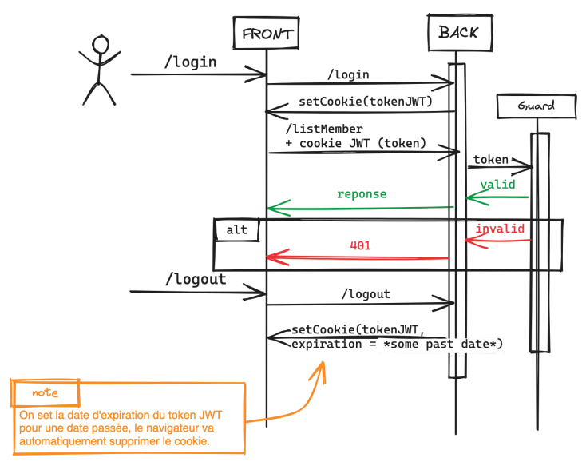

## GraphiQL usage

Use [GraphiQL interface](http://127.0.0.1:63280/graphiql) without having a proper login interface.

### Login

As we're using the [lexik JWT bundle](https://github.com/lexik/LexikJWTAuthenticationBundle) and security rules on the graphql endpoint, 
we generally need a connection token to carry out queries via GraphiQL. 




### How to get a token

1. Import [this API collection](res/postman/API.postman_collection.json) into Postman and login 
as a User or Admin. 

2. Copy/Paste the response token into [.env.local](../.env.local) like :
```
###> graphiql ###
GRAPHIQL_JWT_TOKEN="token-jwt-azertyuiopqsdfghjklmwxcvbn"
###< graphiql ###
```

> [!TIP]
> If you've already developed a login interface, you can use it to get a token.
> 
### How to use GraphiQL

Don't forget to install GraphQL extention to your IDE and generate the schema.graphql

See this [introduction and documentation about exploring data with GraphiQL](https://experienceleague.adobe.com/docs/experience-manager-cloud-service/content/headless/graphql-api/graphiql-ide.html?lang=fr).
