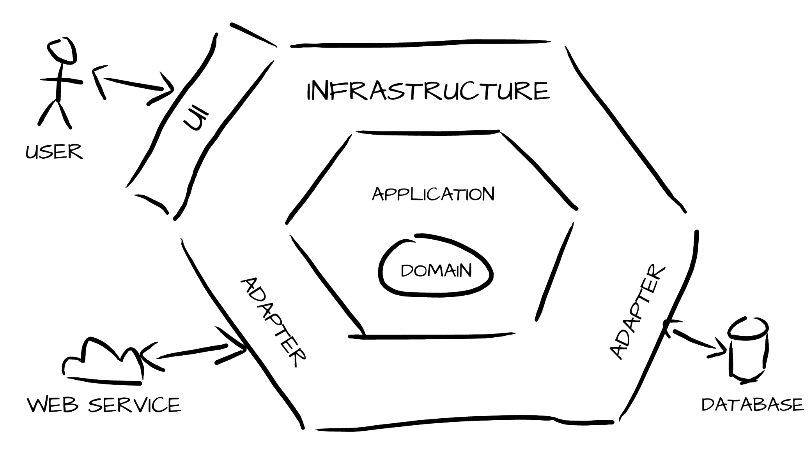

>[!WARNING]
> Markdown on construction

# Hexagonal Architecture

Also known as Ports & Adapters, is characterized by two main principles:

1. The separation between business code and technical code (making the business code agnostic of the technical architecture),
2. Dependency inversion: the technical code depends on the business code and not the other way around, particularly through the use of the adapter design pattern.

We have a layered architecture representing the different parts of a Symfony application:

- **Domain**: The core business of the code.
- **Application**: Application code, commands, queries with interfaces for isolation.
- **Infrastructure**: Implementation of the adapters described in the interfaces of the lower layers and the services necessary to communicate with the infrastructure.

> [!NOTE]
> See : [Hexagonal Architecture](https://www.elao.com/blog/dev/architecture-hexagonale-symfony) for more information.
